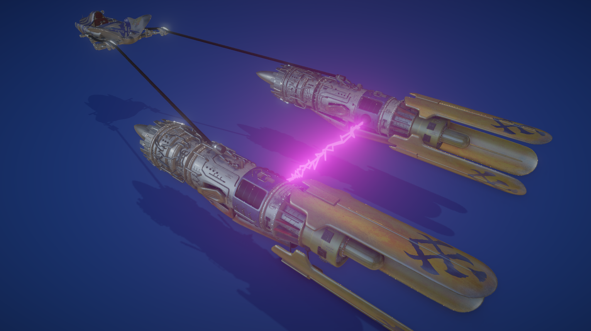
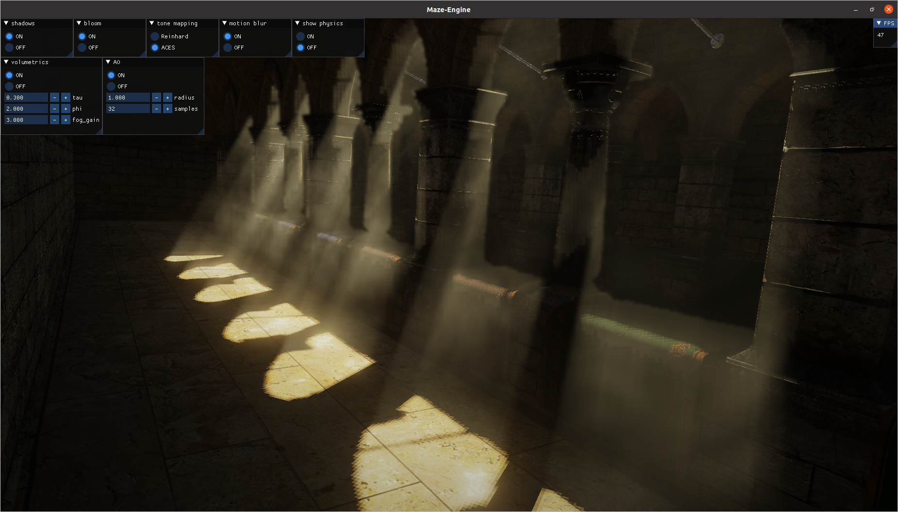
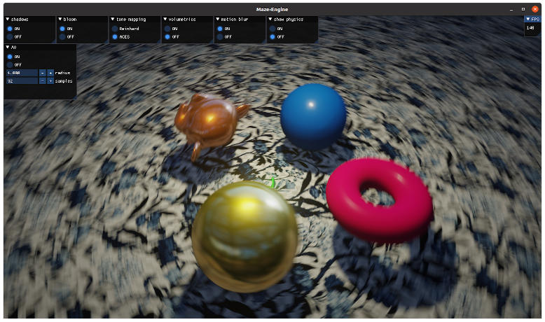
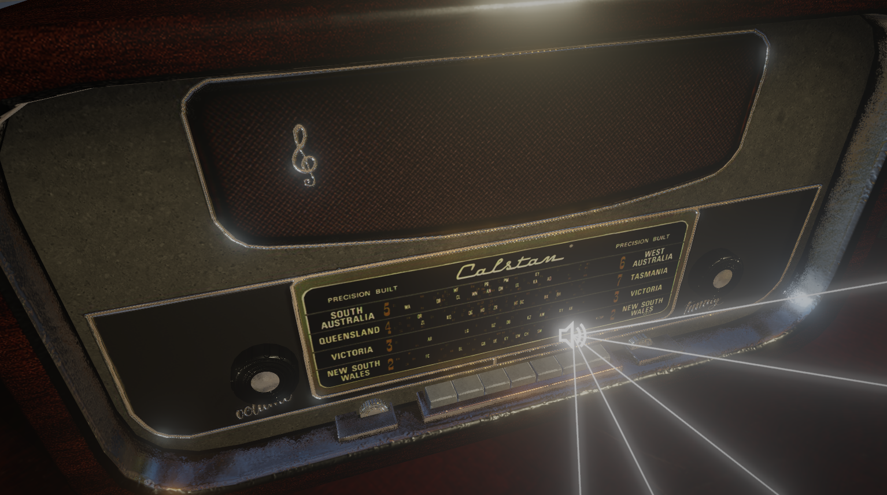

# MAZE-engine
A simple, rudimentary and low level 3D game engine, written in C++17.

**Features**
* scene explorer camera and third person camera
* blinn phong and PBR materials (PBR is only supported with glTF/glb format at the moment)
* image based lighting
* point, spot and directional light sources (max 10 light sources per scene)
* skybox
* shadow mapping
* screen space ambient occlusion
* bloom (xml data)
* lightning
* Ordered transparency (xml data)
* volumetric lighting
* motion blur
* vignette
* anti-aliasing
* 3D animated model loading with the ASSIMP library
* physics with the BULLET engine : rigid bodies, soft bodies, kinematic character controller and vehicle controller
* debug draw for the BULLET engine
* fire particle system
* audio management with the OPENAL library
* DDS textures for fast scene loading and efficient VRAM usage (tested with fbx files : approximately 7 to 8 times faster than glb files which have png/jpg textures)
* custom collision shapes for rigid bodies
* text rendering

**CMAKE build system**

The following variables must be defined :

* ${SDL2\_INCLUDE\_DIR}
* ${SDL2\_LIB\_DIR}
* ${SDL2\_LIBS}
* ${GLEW\_INCLUDE\_DIR}
* ${GLEW\_LIB\_DIR}
* ${GLEW\_LIBS}
* ${ASSIMP\_INCLUDE\_DIR}
* ${ASSIMP\_LIB\_DIR}
* ${ASSIMP\_LIBS}
* ${BULLET\_INCLUDE\_DIR}
* ${BULLET\_LIB\_DIR}
* ${BULLET\_LIBS}
* ${OPENAL\_INCLUDE\_DIR}
* ${OPENAL\_LIB\_DIR}
* ${OPENAL\_LIBS}
* ${LIBSNDFILE\_INCLUDE\_DIR}
* ${LIBSNDFILE\_LIB\_DIR}
* ${LIBSNDFILE\_LIBS}
* ${FREETYPE\_INCLUDE\_DIR}
* ${FREETYPE\_LIB\_DIR}
* ${FREETYPE\_LIBS}
* ${ENET\_INCLUDE\_DIR}
* ${ENET\_LIB\_DIR}
* ${ENET\_LIBS}

On Windows, a good way to acquire those libraries is to use vcpkg with git bash,\
and store them in a short path location like "C:\dev".

About Bullet, the following linking order must be respected when setting the value\
for ${BULLET\_LIBS} : BulletSoftBody, BulletDynamics, BulletCollision, LinearMath.

## DEMO
### Character controller

### Third person camera

### Bullet physics debug draw

### Vehicle controller

### Bloom

### Lightning

### Volumetric Lighting

### Motion blur

### 3D audio

## TO DO
**AI**
* Pathfinding
* Navmesh

**UI**
* OpenGL based user interface (buttons, menus, layout).

## BUGS
* if/else statement not working (volumetric shader: switch between light types)
* Wheels of vehicle controller rotate in wrong direction
